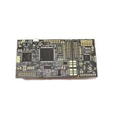

# GREHACK

# CHALLENGE HARDWARE:

# Contexte du challenge

Ce challenge est un **exercice de fault injection** basé sur une carte **ChipWhisperer-Lite CW1173** équipée d’une cible **Cortex-M4 STM32F3** 



Le firmware contient :

```c
uint8_t FLAG1[16] = {'G','H','{','X','X','X','X','X','X','X','X','X','X','X','}','\0'};
uint8_t NOPE[16]  = {
    '*','a','c','c','e','s','s',' ',
    'd','e','n','i','e','d',
    '*','\0'
};
// ainsi que
for(uint8_t i=0; i < 15; i++) {
    result |= pw[i] ^ passwd[i];
}
if (result == 0) {
    simpleserial_put('r', 15, FLAG1);   // FLAG1
} else {
    simpleserial_put('r', 15, NOPE);
}

```

**Normalement FLAG1 n’est envoyé que si le password est correct**, mais *on n’a pas le password* → donc il faut utiliser un **glitch** pour forcer `result == 0`.

## Pourquoi le glitch fonctionne:

`result` vaut 0 *seulement si toutes les différences sont 0*.

Sauf qu’un glitch bien placé **peut sauter une instruction dans la boucle** :

→ typiquement l’instruction **EOR** (XOR)

→ dans ce cas, `result` **reste 0** alors que le mot de passe est faux.

Donc :

**Si un glitch empêche l’exécution d’un XOR → résultat == 0 → FLAG1 sort.**

En revanche on obtient **access denied**  si on se trompe donc on peut filtrer facilement les succès des échecs.

Je vais épargner toute la partie du code permettant de setup l’environnement.

### **Commande simpleserial**

La fonction est attachée sur `'z'` et on sait que le flag fait 15 caractères:

```python
simpleserial_addcmd('z', 15, password_GH);
```

Donc on envoie 15 bytes aléatoires:

```python
target.simpleserial_write('z', bytes([0x5A]*15))
```

(le contenu n’a aucune importance, il sera faux).

Et on capture la réponse:

```python
val = target.simpleserial_read_witherrors('r', 15)
```

## Mais comment trouver le glitch?

On scanne des valeurs de :

- `scope.glitch.width`
- `scope.glitch.offset`
- `scope.glitch.ext_offset`

À chaque combinaison :

- reset
- arm
- envoi du mot de passe faux
- lecture

Quand la réponse commence par `"GH{"` → **on vient de sauter un XOR dans la boucle** → **FLAG1 obtenu**.

par exemple avec ces paramètre on a réussi à obtenir le flag:

`width=10.15625, offset=-1.171875, ext_offset=6`

Mais cela dépend de plein de paramètres comme la température ambiante, la puissance de la machine utilisée etc… donc c’est résultats sont propres à mes tests.

Finalement on retrouve le flag en hexadecimal qui une fois déchiffré donne:

`GH{U_GL1TCH_it}`
